# RPA reference lineage and development specification

이 문서는 `agent-harness`가 어떤 RPA·접근성 자동화·컴퓨터 사용 에이전트
프로젝트와 논문을 참고했는지, 참고한 원칙을 어느 파일에 반영했는지, 아직
반영하지 않은 영역이 무엇인지 기록한다. 구현을 특정 제품의 복제품으로
설명하지 않고, 확인한 근거와 우리 설계의 선택을 분리하는 것이 목적이다.

- 검토 기준일: 2026-09-21
- 저장소: `Hskim-droid/dropkit-agent-harness`
- 현재 기준 커밋: generic surface 구현 위에 이 문서와 관찰 세대 고정이 추가되는 변경
- 공개 코드에 ERP 주소, 쿠키, 메일 자격 증명, 실제 업무 자료를 넣지 않는다.

## 1. 이 프로젝트의 분류

RPA 문헌에서 말하는 소프트웨어 로봇은 사람이 반복적으로 수행하던 규칙 기반
업무를 대신 실행하는 자동화에 가깝다. 이 프로젝트도 그 범주에 들어가지만,
처음부터 모든 업무를 무인 실행하는 RPA 플랫폼을 만들지는 않는다.

현재 구현의 정확한 분류는 다음과 같다.

> **증거에 묶인 draft-first UI RPA 제어면**
> (evidence-bound, task-contract-driven, read-only UI RPA control plane)

여기서 AI는 화면을 무제한으로 클릭하는 주체가 아니다. 작업 계약이 허용한
시스템과 산출물 형식을 확인하고, 로컬 UI 어댑터가 보고한 관찰 그래프에서
대상을 선택하며, 관찰 시점과 결과 증거를 큐에 남긴다. 작성·승인·메일 발송은
별도 권한과 사람 승인 단계로 남겨 둔다.

이 구분은 세 가지 계층을 분리한다.

1. **RPA control plane**: persona, 허용 시스템, 큐, 멱등 키, 재시도 복구,
   산출물 해시, 이벤트 원장.
2. **Surface adapter**: 브라우저 접근성 트리, macOS AXUIElement, Windows UI
   Automation처럼 특정 화면의 관찰과 의미 있는 동작을 제공한다.
3. **Task planner/extractor**: 별칭으로 메뉴와 표를 찾고, 읽기 결과를 구조화한
   레코드와 manifest로 변환한다.

표면 어댑터를 바꾸어도 큐와 증거 계약은 유지해야 한다. 반대로 네이티브 UI가
브라우저와 같은 표 구조를 제공하지 않는다면, 브라우저용 표 planner를
그대로 재사용한다고 주장하지 않는다.

## 2. 조사 질문과 채택 원칙

이번 개발 단계의 질문은 다음 네 가지다.

| 질문 | 채택한 원칙 | 현재 상태 |
| --- | --- | --- |
| Q1. 모르는 메뉴와 DOM을 어떻게 찾는가? | CSS/XPath 고정 경로보다 role·accessible name·명시적 별칭을 우선하고, 모호하면 중단한다. | 브라우저 구현 완료 |
| Q2. MacBook과 Windows 노트북을 어떻게 같은 계약으로 다루는가? | 플랫폼별 API는 어댑터 안에 가두고 `UiObservation`·`ActionRequest`·`ActionReceipt`만 공유한다. | Mac AX/Windows UIA 선택형 어댑터 완료 |
| Q3. 화면 변화와 권한 오류로 잘못된 동작이 발생하지 않게 하는가? | 명시적 앱/창 루트, 현재 관찰 ID, capability·enabled·uniqueness 확인, partial/error fail-closed. | 구현·회귀검사 완료 |
| Q4. 결과를 RPA 실행으로 재현·감사할 수 있는가? | 멱등 큐, 이벤트 원장, source reference, artifact hash, manifest 검증을 실행 경계로 둔다. | control plane 완료; 실제 메일·스케줄러는 미구현 |
| Q5. 화면에서 읽은 자료를 어떻게 로컬 번역하고 문서화하는가? | 원문 보존 → 로컬 모델 번역 → 선택 포맷 렌더 → 재오픈 검증의 분리된 단계로 둔다. | 번역 adapter·fixture DOCX 연결 완료; 실제 모델/포맷 확장은 별도 |

## 3. 참고 프로젝트와 논문 → 설계 결정

### 3.1 RPA의 범위와 프로세스 선정

| 참고 | 확인한 주장/기능 | 이 저장소의 반영 | 반영하지 않은 것 |
| --- | --- | --- | --- |
| [Wewerka & Reichert, *Robotic Process Automation – A Systematic Literature Review and Assessment Framework* (2020)](https://arxiv.org/abs/2012.11951) | RPA를 규칙 기반 반복 업무 자동화로 정리하고, 자동화 적합성·도구·효과를 비교하는 평가 틀(ANCOPUR)을 제안한다. | 작업 계약에 시스템·persona·출력 형식·금지 동작을 명시하고, 결과를 정량 검증 가능한 manifest로 만든다. | 이 저장소가 모든 RPA 연구를 재평가하거나 자동화 적합성을 AI 점수 하나로 판정한다고 주장하지 않는다. |
| [El-Gharib & Amyot, *Robotic Process Automation Using Process Mining – A Systematic Literature Review* (2022)](https://arxiv.org/abs/2204.00751) | 이벤트 로그 수집·정제·프로세스 발견이 RPA 후보 선정과 운영 개선에 중요하나, 로그 정제와 lifecycle 지원이 어렵다고 정리한다. | `events` 원장에 큐·handoff·draft 결과·복구 이벤트를 기록할 수 있게 했다. | 아직 사용자의 실제 클릭 로그를 수집해 process mining 모델을 학습하거나 업무 후보를 자동 발굴하지 않는다. |
| [Khantong & Sriboonlue, *Robotic Process Automation in Business Process Management: A Systematic Literature Review and an Integrated Framework* (2026)](https://www.mdpi.com/2227-7080/14/4/225) | RPA-BPM 연구를 프로세스 선정, lifecycle, 성과, 장애, 기술 통합, 거버넌스의 여섯 축으로 묶는다. | 문서에서 queue·adapter·artifact·approval·audit을 별도 계층과 완료 조건으로 구분한다. | 2026년 리뷰의 모든 산업 사례나 성과 수치를 이 fixture의 성능으로 인용하지 않는다. |

### 3.2 실행 프레임워크와 UI 표면

| 참고 | 확인한 원칙 | 이 저장소의 반영 | 반영하지 않은 것 |
| --- | --- | --- | --- |
| [Robot Framework](https://github.com/robotframework/robotframework), [RPA guide](https://docs.robotframework.org/docs/getting_started/rpa) | OS·애플리케이션 독립적인 확장 구조, task/keyword와 라이브러리 분리, 재현 가능한 의존성 관리. | task contract, local adapter, output manifest를 분리하고, 공개 repo에는 운영용 connector와 자격 증명을 넣지 않는다. synthetic fixture와 native fake tree는 검증 코드로 포함한다. | Robot Framework 문법이나 런타임을 직접 의존성으로 추가하지 않는다. |
| [RPA Framework](https://github.com/robocorp/rpaframework), [Desktop library](https://rpaframework.org/libraries/desktop/) | 브라우저·파일·메일·Windows desktop 등 업무용 라이브러리를 Python/Robot 생태계로 조합한다. | 나중에 adapter를 교체할 수 있는 경계를 유지하고, 선택적 native binding을 실행 시점에만 로드한다. | `rpaframework` 전체를 vendor하거나, 검증하지 않은 Gmail/ERP connector를 공개 기본값으로 켜지 않는다. |
| [TagUI](https://github.com/aisingapore/TagUI) | 간단한 RPA 흐름과 여러 입력 방식, XPath/좌표 기반 웹 자동화의 실용적 사례를 제공한다. 좌표·DOM 경로는 zoom·UI 변경에 취약하다. | 좌표 클릭을 일반 해법으로 채택하지 않고, role/name·접근성 API·observed node ID를 우선한다. | 화면에 접근성 정보가 없을 때 자동으로 좌표/OCR fallback을 켜지 않는다. |
| [Playwright locators](https://playwright.dev/docs/locators), [locator best practices](https://github.com/microsoft/playwright/blob/main/docs/src/best-practices-js.md) | role·accessible name 같은 사용자 관점 locator를 우선하고, locator의 auto-wait/actionability와 uniqueness를 활용한다. | `PlaywrightAriaAdapter`가 role/name을 관찰하고, 실행 전 visible·enabled·name·unique를 다시 확인한다. `observation_id`로 관찰 시점을 고정한다. | Playwright의 locator만으로 모든 native 앱과 표 추출을 해결한다고 확장하지 않는다. |
| [Microsoft UI Automation overview](https://learn.microsoft.com/en-us/windows/win32/winauto/uiauto-uiautomationoverview), [tree overview](https://learn.microsoft.com/en-us/windows/win32/winauto/uiauto-treeoverview) | UIA는 control type·property·control pattern을 가진 트리이며, 트리는 동적으로 변하고 전체 desktop tree는 매우 크다. | Windows 어댑터는 명시적 window root와 runtime ID를 받고, `Invoke`/`Select` pattern만 호출하며, 열거 오류와 다른 관찰 세대의 요청을 중단한다. | desktop root를 기본으로 긁거나 `click_input` 같은 좌표/입력 주입을 기본 동작으로 넣지 않는다. |
| [Apple AXUIElement.h](https://developer.apple.com/documentation/applicationservices/axuielement_h), [CopyAttributeValue](https://developer.apple.com/documentation/applicationservices/1462085-axuielementcopyattributevalue), [PerformAction](https://developer.apple.com/documentation/applicationservices/1462091-axuielementperformaction) | macOS 앱 UI는 AX hierarchy·attribute·action을 제공하고, API trust/permission 및 invalid element 오류를 고려해야 한다. | PID 또는 명시적 AX root, `AXRole`·`AXTitle`·`AXChildren`·action names 관찰, AX error를 빈 화면으로 숨기지 않는 fail-closed를 사용한다. | 실제 Mac 앱별 control pattern과 권한을 현재 환경에서 검증했다고 말하지 않는다. |

### 3.3 AI computer-use 평가에서 가져온 검증 기준

| 참고 | 확인한 문제 | 이 저장소의 반영 | 남은 차이 |
| --- | --- | --- | --- |
| [BrowserGym ecosystem](https://arxiv.org/abs/2412.05467) | 웹 에이전트 비교를 위해 observation/action space와 benchmark 실행 조건을 통일해야 한다. | backend-neutral `UiObservation`, `ActionRequest`, `ActionReceipt`와 synthetic variants를 둔다. | BrowserGym benchmark 전체, AgentLab, 실제 웹 서비스 task suite를 가져오지 않았다. |
| [OSWorld](https://arxiv.org/abs/2404.07972) | 실제 web/desktop 앱과 파일·다중 앱 workflow를 실행하고, 초기 상태와 execution evaluator로 평가해야 한다. GUI grounding과 operational knowledge가 병목이다. | fixture를 variant로 나누고, 화면 관찰·action·record ID·artifact reopen 검사를 분리한다. | 369개 실제 앱 task 규모나 OS별 benchmark 점수를 재현하지 않는다. |
| [OSWorld-Human](https://arxiv.org/abs/2506.16042) | 모델 호출과 불필요한 step이 실제 latency를 크게 늘린다. 사람 trajectory와 step efficiency를 별도로 비교할 필요가 있다. | action receipt와 event 원장을 두어 step count·실패 유형을 추후 측정할 수 있게 한다. | 현재 fixture에 human trajectory, latency baseline, 비용 계측은 없다. |

상용 RPA의 참고 사례로는 [Power Automate desktop UI automation](https://learn.microsoft.com/en-us/power-automate/desktop-flows/desktop-automation)을 확인했다. UI element를 캡처하고 foreground window에서 조작하는 운영 모델은 참고하지만, 이 저장소는 상용 제품·라이선스·클라우드에 종속되지 않는다.

### 3.4 로컬 모델 번역과 산출물 경계

| 참고 | 공개 코드에서 확인한 구조 | 이 저장소의 반영 | 반영하지 않은 것 |
| --- | --- | --- | --- |
| [`Hskim-droid/local-llm`](https://github.com/Hskim-droid/local-llm) 및 [`hardware.py`](https://raw.githubusercontent.com/Hskim-droid/local-llm/main/hardware.py) | 로컬 하드웨어(RAM·가용 메모리·GPU·swap)를 읽어 `gram16`·`gram32`·`mac24` 같은 프로필을 선택하는 부트스트랩 구조를 둔다. | `bootstrap.py`가 개인 식별자 없이 호스트 capability를 기록하고, 모델 선택은 별도 local-engine 설정으로 남긴다. | 공개 저장소의 프로필 숫자나 특정 모델 크기를 모든 사용자의 권장값으로 복사하지 않는다. 실제 장치에서 다시 측정한다. |
| [`ollama_client.py`](https://raw.githubusercontent.com/Hskim-droid/local-llm/main/ollama_client.py) | localhost Ollama API에서 모델을 선택·pull하고 chat JSON을 호출한다. | `translation_pipeline.py`에 loopback-only Ollama-compatible adapter를 두고, 응답 JSON이 계약과 다르면 중단한다. 서버가 `OLLAMA_NO_CLOUD=1`로 재시작되어야 하며 cloud-tagged model name도 거부한다. manifest에는 loopback 전송과 모델 서버 실행 위치를 별도 기록하며 원문을 외부 endpoint로 보내는 fallback은 없다. | Ollama 설치·모델 weight 다운로드·cloud API를 기본 부트스트랩에 포함하지 않는다. |
| [`render.py`](https://raw.githubusercontent.com/Hskim-droid/local-llm/main/render.py), [`schema.json`](https://raw.githubusercontent.com/Hskim-droid/local-llm/main/schema.json), [`packs/README.md`](https://raw.githubusercontent.com/Hskim-droid/local-llm/main/packs/README.md) | 구조화된 content JSON을 고정 템플릿 DOCX로 만들고, report/minutes/translation pack을 구분한다. renderer는 모델 호출과 분리된다. | `TranslationBatch`가 원문·번역문·source_ref를 함께 보존하고, `document_renderers.py`가 같은 record view를 DOCX/XLSX/PPTX로 렌더한 뒤 형식별 reopen/cell 검사를 수행한다. manifest에는 번역 backend·언어·필드별 증거를 추가한다. | 실제 pack schema 호환, 음성/vision/whisper 경로, 사용자별 고급 템플릿·스타일 선택, PPTX 페이지 분할·앱 렌더 검증은 아직 연결하지 않는다. |

이 참고 프로젝트와의 통합은 실행 파일을 복사하는 방식이 아니라 계약을
분리하는 방식이다. UI 어댑터가 수집한 원본 레코드는 `records`로 남고,
번역 단계는 선택된 텍스트 필드만 local model에 보내 `translation` evidence를
만든다. renderer는 `document_records`를 사용하므로 번역 실패가 원본 증거를
덮어쓰거나 UI 화면에 쓰기 동작을 일으키지 않는다. `PassthroughTranslator`는
모델이 없는 fixture 검사용이고, production 경로에서는 `OllamaTranslator` 또는
검토된 다른 loopback engine을 명시적으로 선택해야 한다.

## 4. 근거에서 코드로 이어지는 추적표

| 설계 요구 | 구현 위치 | 검증 | 상태 |
| --- | --- | --- | --- |
| semantic browser discovery | `browser_probe.py` | `tests/test_browser_probe.py`, 3 variant | 완료 |
| backend-neutral observation/action/evidence | `surface_adapter.py` | `tests/test_surface_adapter.py` | 완료 |
| macOS AX / Windows UIA optional adapters | `native_adapters.py` | fake tree·permission·partial failure tests | 실제 호스트 전 검증 완료 |
| action은 관찰 ID에 고정 | `ActionRequest.observation_id`, adapter execute | stale observation tests | 완료 |
| ambiguity·forbidden action 차단 | `browser_probe.py` task contract | duplicate/forbidden tests | 완료 |
| partial/error tree에서 native action 차단 | `native_adapters.py` | transactional cache tests | 완료 |
| queue priority·idempotency·stale recovery | `harness.py` | `tests/test_harness.py` | 완료 |
| artifact format·hash·manifest check | `harness.py`, `fixture_demo.py`, `document_renderers.py` | DOCX/XLSX/PPTX reopen/hash tests | 완료 |
| user-selected office renderer | `document_renderers.py`, `fixture_demo.py` | DOCX/XLSX/PPTX reopen and cell checks | 완료 |
| local translation boundary | `translation_pipeline.py`, `fixture_demo.py` | passthrough evidence, loopback endpoint, invalid JSON, translated DOCX fixture | 완료 |
| host capability mapping | `bootstrap.py` | report identity redaction, allowlisted plan, explicit network gate | 완료 |
| 승인 전송·메일·스케줄 | local config interface only | 실제 sender 없음 | 미구현 |
| native table extraction | adapter boundary only | browser table만 있음 | 미구현 |
| process mining 기반 후보 발굴 | events 원장만 있음 | 실제 사용자 event log 없음 | 미구현 |

## 5. 현재 실행 경계와 목표 구조

아래 그림은 목표 통합 구조다. 현재 연결 완료 여부는 아래 추적표를 기준으로
판단하며, 점선은 아직 연결하지 않은 local scheduler·email·승인·sender 경로다.

```mermaid
flowchart LR
    I[manual enqueue / local invocation] --> Q[queue + persona policy]
    Q --> P[task contract / semantic planner]
    P --> O[observe explicit surface root]
    O --> A[ActionRequest pinned to observation_id]
    A --> X[Playwright / macOS AX / Windows UIA]
    X --> E[ActionReceipt + event log]
    E --> R[read and validate records]
    R --> L[local translation / normalization]
    L --> M[one artifact + manifest + SHA-256]
    M -.-> H[planned human approval gate]
    H -.-> S[planned local sender adapter]
    I -.-> T[planned scheduler / validated email intake]
    T -.-> Q
```

실행 불변식은 다음과 같다.

- 전체 desktop/system root를 자동 선택하지 않는다. application/window root가
  명시되지 않으면 실패한다.
- `target` 객체를 외부에서 주입해 관찰을 우회하지 않는다.
- `observation_id`가 현재 surface와 다르면 실행하지 않는다.
- 관찰이 부분적이거나 권한/열거 오류가 나면 성공한 일부 node를 사용하지 않는다.
- 브라우저 planner는 target의 role/name/visible/enabled/uniqueness와 forbidden
  policy를 확인한다. 현재 native adapter는 관찰된 node의 role/action/enabled와
  observation generation을 확인하며, browser의 forbidden menu 정책을 자동으로
  상속하지 않는다.
- 현재 fixture 결과는 job이 선택한 output format 하나와 hash가 있는 manifest로
  검증한다. 번역을 켜면 원문 레코드와 필드별 번역 evidence를 manifest에 남기고,
  번역된 view를 선택된 문서에 넣은 뒤 형식별 reopen 검사로 확인한다. generic
  probe와 native adapter의 결과를 queue·manifest에 연결하는 통합과 고급
  템플릿 선택은 별도 작업이다.

## 6. 실제 개선 항목과 종료 조건

### 이번 변경에서 반영한 것

`UiObservation`의 내용 비교용 `observation_hash`와 관찰 세대용
`observation_id`를 분리했다. `ActionRequest`는 generation-specific ID를 필수로
받고, planner가 관찰한 뒤 만든 요청이 다음 관찰에서 다른 버튼·메뉴로
재매핑되지 않도록 native/browser adapter가 현재 관찰과 ID를 비교한다.
`ActionReceipt.evidence`에도 이 ID를 기록한다.
이는 UI 트리의 위치 ID와 구조가 동적이라는 UIA 문서, locator가 현재 시점에
다시 해석된다는 Playwright 동작을 함께 고려한 fail-closed 보강이다. UIA의
모든 트리 변경을 감시한다는 뜻은 아니며, 다른 관찰 세대의 요청을 거부한다는
뜻이다.

UI read 이후에 붙는 `translation_pipeline.py`도 같은 fail-closed 원칙을
사용한다. 번역기는 `local_only=True` 내부 계약을 선언해야 하고, manifest는
`local_transport_only`와 `transport_scope`를 따로 기록한다. Ollama-compatible
endpoint는 `localhost`, `127.0.0.1`, `::1`만 허용하고 proxy·redirect를 차단한다. 응답은
`{"translation": "..."}` JSON 계약을 지켜야 하며, 그렇지 않으면 artifact를
만들지 않는다. manifest에는 loopback 전송 확인과 모델 서버 실행 위치 미검증을
구분해 기록한다. 원문과 번역문은 모두 manifest의 필드별 evidence로 남기고,
renderer가 사용할 복사본만 평탄화한다. 따라서 현장 화면을 읽는 권한과
모델을 실행하는 권한, 외부 발송 권한을 한 단계로 합치지 않는다.

### 다음에 구현할 순서

| 순서 | 최소 시험 | 성공 기준 | 중단/전환 조건 |
| --- | --- | --- | --- |
| 1. 공통 semantic planner | 같은 `UiObservation`에서 alias·role·forbidden·action으로 한 node 선택 | browser/native가 동일 planner contract와 ambiguity 결과를 사용 | native role/name이 부족하면 surface-specific planner로 분리 |
| 2. native read adapter | fake AX/UIA table 또는 list에서 record ID·source ref 추출 | browser와 같은 manifest schema로 DOCX fixture를 재생성 | 앱이 table semantics를 노출하지 않으면 OCR을 기본값으로 넣지 않고 전용 adapter 보류 |
| 3. action/postcondition evaluator | click 뒤 observation diff 또는 expected state 검증 | receipt가 “호출됨”과 “업무 상태가 바뀜”을 구분 | 상태 확인 불가능하면 draft-only 유지 |
| 4. event-log benchmark | fixture와 synthetic human trajectory의 action·latency 수집 | 성공률·step 수·ambiguity·recovery를 버전별 비교 | 실제 업무 로그 권한/비식별화가 없으면 공개 dataset만 사용 |
| 5. real-host validation | Mac AX permission과 Windows UIA window root 각각 1개씩 | 실제 창에서 observe→pinned action→artifact manifest 통과 | 권한·control pattern 불안정 시 native 실행은 계속 optional로 둠 |
| 6. local model validation | 고정 레코드와 loopback mock/실제 모델 1회 | 원문 보존·번역 evidence·선택 포맷 reopen이 일치하고 endpoint가 외부 주소를 거부 | 모델 JSON 불안정·메모리 부족이면 passthrough/사람 검토로 중단 |

이 표의 항목은 구현 승인 목록이 아니라, 현재 범위에서 확인된 공백과 작은
검증 단위다. 실제 ERP·메일·승인 권한을 켜기 전에 각 종료 조건을 충족해야 한다.

## 7. 조사 방법과 한계

오픈소스는 공식 저장소·공식 문서에서 현재 구조와 라이선스 정보를 확인했고,
학술 자료는 arXiv 또는 공개 학술 페이지의 초록·방법·한계만 확인했다. 검색
결과의 숫자나 모델 점수를 이 프로젝트의 성능으로 옮기지 않았다. 실제
MacBook/Windows 노트북에서 ERP 권한, 앱별 AX/UIA provider, 화면 변화, 메일
발송을 검증하지 않았으므로, 이 문서는 구현 근거 추적 문서이지 production
인증서가 아니다.

추가 의존성을 넣을 때는 저장소의 현재 라이선스와 보안 상태를 다시 확인하고,
특정 RPA 제품의 recorder·cloud control room·credential vault를 기본 경로로
가정하지 않는다.
